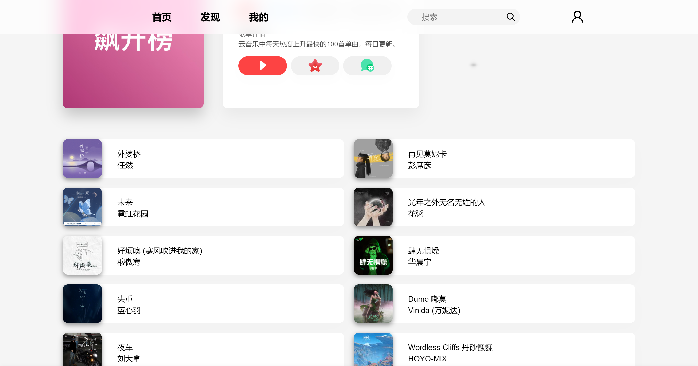
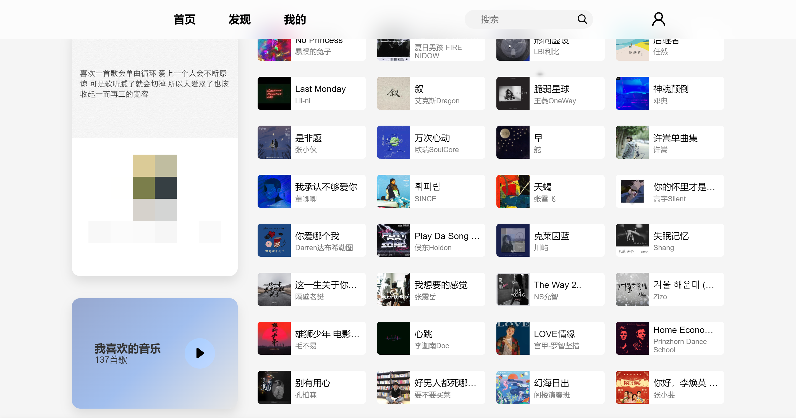

# AndMusic

#### 介绍

AndMusic 是 基于 [网易云音乐 API](https://binaryify.github.io/NeteaseCloudMusicApi/#)
界面风格参考了各平台、实现了一些基础功能、代码还在完善中...

#### 安装教程

1. 部署网易云音乐 API 参考[Binaryify/NeteaseCloudMusicApi](https://github.com/Binaryify/NeteaseCloudMusicApi)

2. 克隆本仓库

```sh
 git clone https://gitee.com/Marukoh/and-music.git
```

3. 安装依赖

```sh
 yarn install
```

4. 运行本项目

```sh
 git clone https://gitee.com/Marukoh/and-music.git
```

#### 使用说明

1.  本项目仅供学习研究使用，禁止用于商业及非法用途。

#### 灵感来源

- [Apple Music](https://music.apple.com)
- [网易云音乐](https://music.163.com)
- [YesPlayMusic](https://github.com/qier222/YesPlayMusic)

#### 效果图
- 首页 
- 发现页 
- 歌曲列表页 
- 我的页面 
